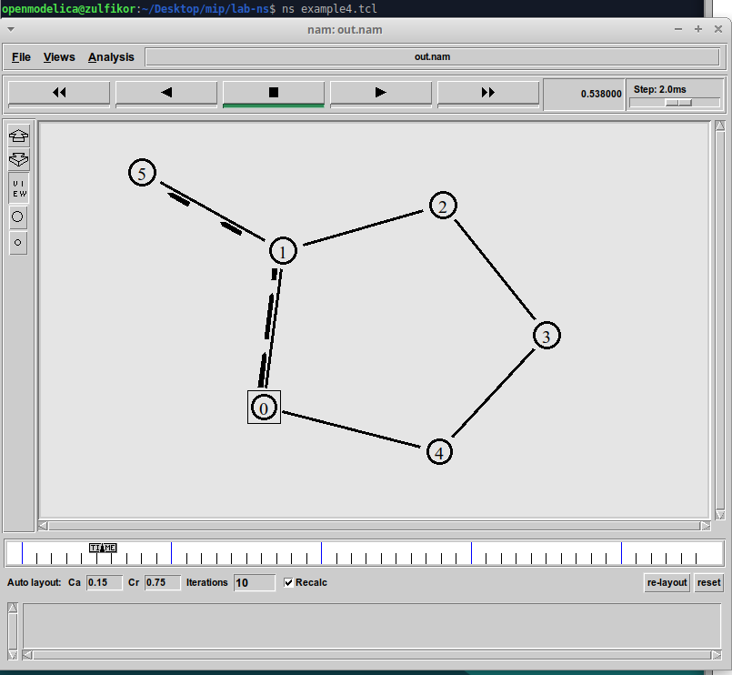
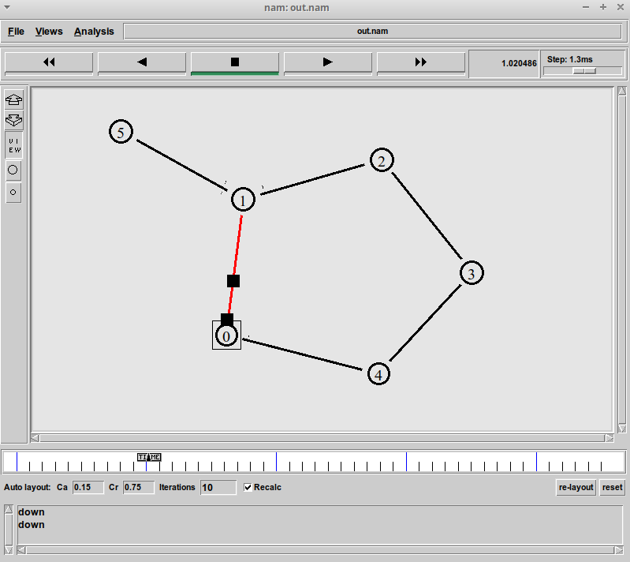
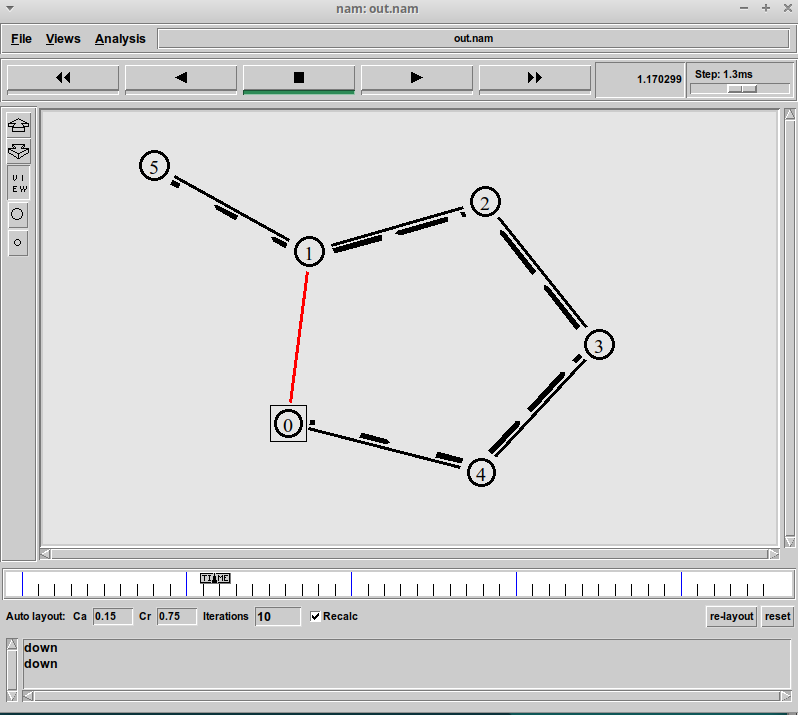
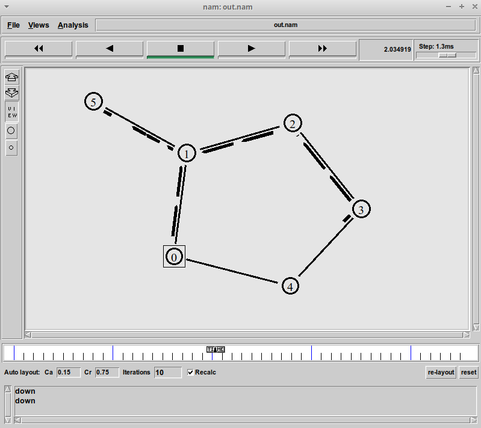
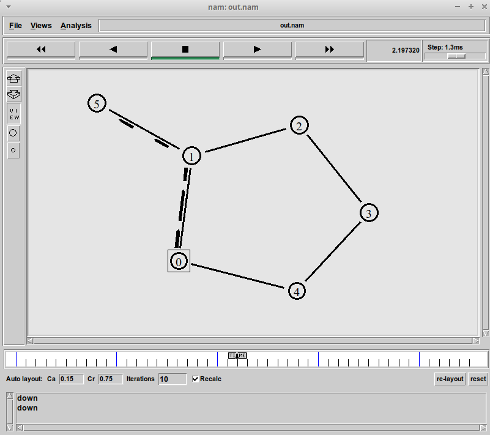

---
## Front matter
lang: ru-RU
title: Лабораторная работа №1
author: |
	 Аминов Зулфикор\inst{1}

institute: |
	\inst{1}Российский Университет Дружбы Народов

date: 23.04, 2022, Москва, Россия

## Formatting
mainfont: PT Serif
romanfont: PT Serif
sansfont: PT Sans
monofont: PT Mono
toc: false
slide_level: 2
theme: metropolis
header-includes: 
 - \metroset{progressbar=frametitle,sectionpage=progressbar,numbering=fraction}
 - '\makeatletter'
 - '\beamer@ignorenonframefalse'
 - '\makeatother'
aspectratio: 43
section-titles: true

---

# Цели и задачи работы

## Цель лабораторной работы

Приобретение навыков моделирования сетей передачи данных с помощью средства
имитационного моделирования NS-2, а также анализ полученных результатов
моделирования.

# Задание к лабораторной работе

## Упражнение

* передача данных должна осуществляться от узла n(0) до узла n(5) по кратчай-
шему пути в течение 5 секунд модельного времени;
* передача данных должна идти по протоколу TCP (тип Newreno), на принимаю-
щей стороне используется TCPSink-объект типа DelAck; поверх TCP работает
протокол FTP с 0,5 до 4,5 секунд модельного времени;
* с 1 по 2 секунду модельного времени происходит разрыв соединения между
узлами n(0) и n(1);
* при разрыве соединения маршрут передачи данных должен измениться на ре-
зервный, после восстановления соединения пакеты снова должны пойти по
кратчайшему пути.

# Результат работы

## Передача данных от узла n(0) до узла n(5)

{ #fig:16 width=100% height=100% }

## Разрыв соединения между узлами n(0) и n(1)

{ #fig:17 width=100% height=100% }

## Изменение маршрут передачи данных на резервный

{ #fig:18 width=100% height=100% }

## Востанавления соединения пакеты по кратчайшему пути

{ #fig:19 width=100% height=100% }

## Востанавления соединения пакеты по кратчайшему пути

{ #fig:20 width=100% height=100% }

# Выводы по проделанной работе

## Вывод

Приобрели навыков моделирования сетей передачи данных с помощью сред-
ства имитационного моделирования NS-2, а также анализировали полученных результатов
моделирования.

