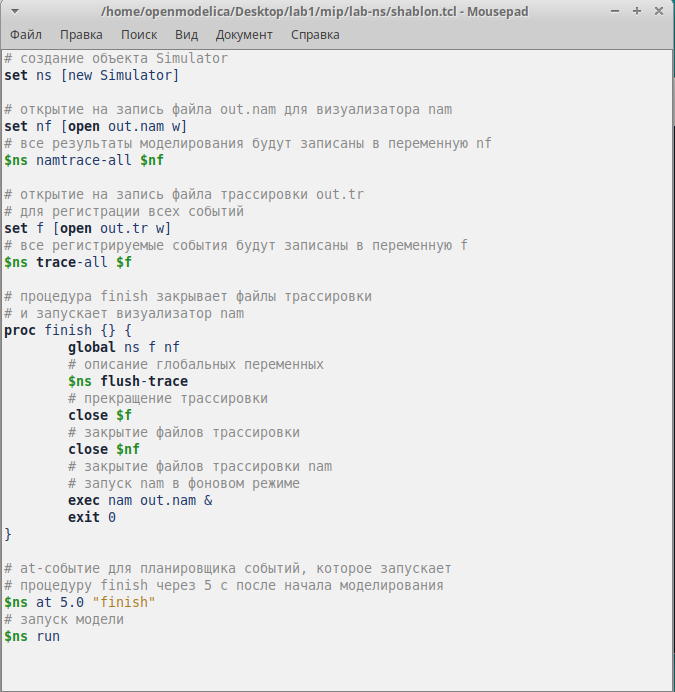
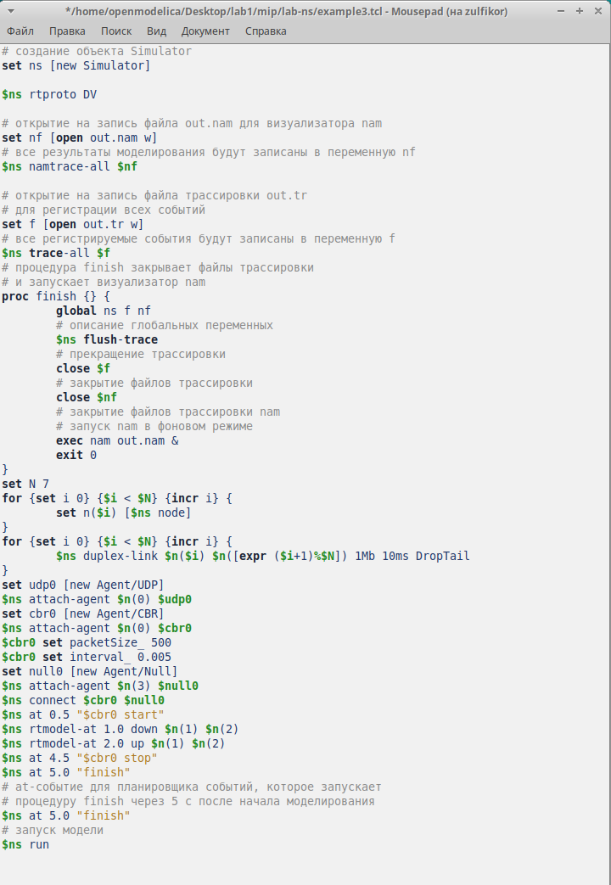
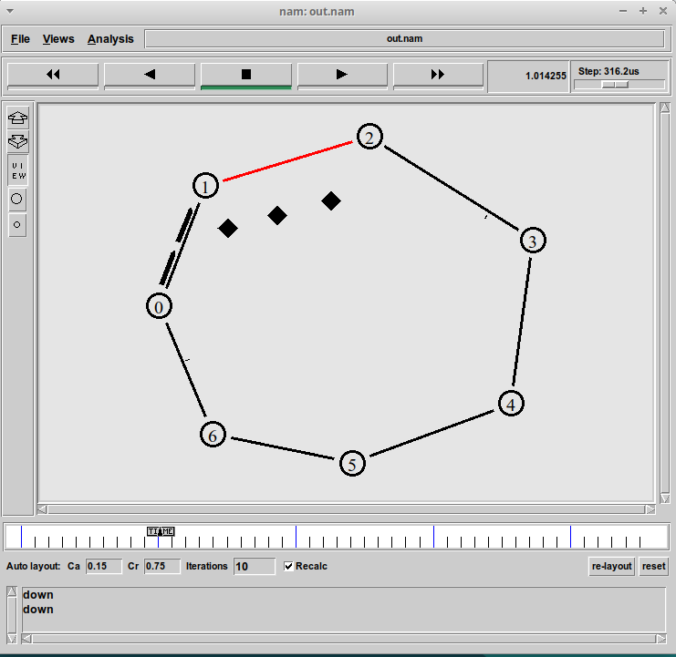

---
# Front matter
title: "Моделирование информационных процессов"
subtitle: "Отчёт по лабораторной работе №1"
author: "Аминов Зулфикор Мирзокаримович"

# Generic otions
lang: ru-RU
toc-title: "Содержание"

# Bibliography
bibliography: bib/cite.bib
csl: pandoc/csl/gost-r-7-0-5-2008-numeric.csl

# Pdf output format
toc: true # Table of contents
toc_depth: 2
fontsize: 12pt
linestretch: 1.5
papersize: a4
documentclass: scrreprt
## I18n
polyglossia-lang:
  name: russian
  options:
	- spelling=modern
	- babelshorthands=true
polyglossia-otherlangs:
  name: english
### Fonts
mainfont: PT Serif
romanfont: PT Serif
sansfont: PT Sans
monofont: PT Mono
mainfontoptions: Ligatures=TeX
romanfontoptions: Ligatures=TeX
sansfontoptions: Ligatures=TeX,Scale=MatchLowercase
monofontoptions: Scale=MatchLowercase,Scale=0.9
## Biblatex
biblatex: true
biblio-style: "gost-numeric"
biblatexoptions:
  - parentracker=true
  - backend=biber
  - hyperref=auto
  - language=auto
  - autolang=other*
  - citestyle=gost-numeric
## Misc options
indent: true
header-includes:
  - \linepenalty=10 # the penalty added to the badness of each line within a paragraph (no associated penalty node) Increasing the value makes tex try to have fewer lines in the paragraph.
  - \interlinepenalty=0 # value of the penalty (node) added after each line of a paragraph.
  - \hyphenpenalty=50 # the penalty for line breaking at an automatically inserted hyphen
  - \exhyphenpenalty=50 # the penalty for line breaking at an explicit hyphen
  - \binoppenalty=700 # the penalty for breaking a line at a binary operator
  - \relpenalty=500 # the penalty for breaking a line at a relation
  - \clubpenalty=150 # extra penalty for breaking after first line of a paragraph
  - \widowpenalty=150 # extra penalty for breaking before last line of a paragraph
  - \displaywidowpenalty=50 # extra penalty for breaking before last line before a display math
  - \brokenpenalty=100 # extra penalty for page breaking after a hyphenated line
  - \predisplaypenalty=10000 # penalty for breaking before a display
  - \postdisplaypenalty=0 # penalty for breaking after a display
  - \floatingpenalty = 20000 # penalty for splitting an insertion (can only be split footnote in standard LaTeX)
  - \raggedbottom # or \flushbottom
  - \usepackage{float} # keep figures where there are in the text
  - \floatplacement{figure}{H} # keep figures where there are in the text
---

# Цель работы

Приобретение навыков моделирования сетей передачи данных с помощью средства
имитационного моделирования NS-2, а также анализ полученных результатов
моделирования.

# Шаблон сценария для NS-2

В своём рабочем каталоге создали директорию mip, внутри mip директроию lab-ns, а в ней файл shablon.tcl:

{ #fig:1 width=100% height=100% }

Открили на редактирование файл shablon.tcl и записали код:

{ #fig:2 width=100% height=100% }

Сохранили изминения в файле shablon.tcl и запустили симулятор:

{ #fig:3 width=100% height=100% }

# Простой пример описания топологии сети, состоящей из двух узлов и одного соединения

Скопировали содержимое созданного шаблона в новый файл:

{ #fig:4 width=100% height=100% }

Откроем example.tcl на редактирование и добавим изменение:

{ #fig:5 width=100% height=100% }

Сохраним изменения и запускаем симулятор:

{ #fig:6 width=100% height=100% }

Получили в качестве результата запуск аниматора nam в фоновом режиме.

# Пример с усложнённой топологией сети

Скопируем содержимое созданного шаблона в example2.tcl.

{ #fig:7 width=100% height=100% }

Откроем example.tcl на редактирование и внесем изминения.

{ #fig:8 width=100% height=100% }
{ #fig:81 width=100% height=100% }

Сохранив изменения в файле запустим симулятор

{ #fig:9 width=100% height=100% }

Получили анимированный результат моделирования.

# Пример с кольцевой топологией сети

Скопируем содержимое созданного шаблона в новый файл:

{ #fig:10 width=100% height=100% }

Откроем example.tcl на редактирование.

{ #fig:11 width=100% height=100% }

Внесли изминения и запустили симулятор:

{ #fig:12 width=100% height=100% }

После запуска в сети отправляется небольшое количество маленьких
пакетов, используемых для обмена информацией, необходимой для
маршрутизации между узлами

{ #fig:13 width=100% height=100% }
{ #fig:14 width=100% height=100% }

# Упражнение

Создали файл example4.tcl и написали код для данного упражнения:

{ #fig:15 width=100% height=100% }

Запустили сумулятор:

{ #fig:16 width=100% height=100% }

Осуществление передача данных от узла n(0) до узла n(5)

{ #fig:17 width=100% height=100% }

разрыв соединения между узлами n(0) и n(1)

{ #fig:18 width=100% height=100% }

Изменение маршрут передачи данных на резервный:

{ #fig:19 width=100% height=100% }

Востанавления соединения пакеты по кратчайшему пути:

{ #fig:20 width=100% height=100% }

# Выводы

Приобрели навыков моделирования сетей передачи данных с помощью сред-
ства имитационного моделирования NS-2, а также анализировали полученных результатов
моделирования.
